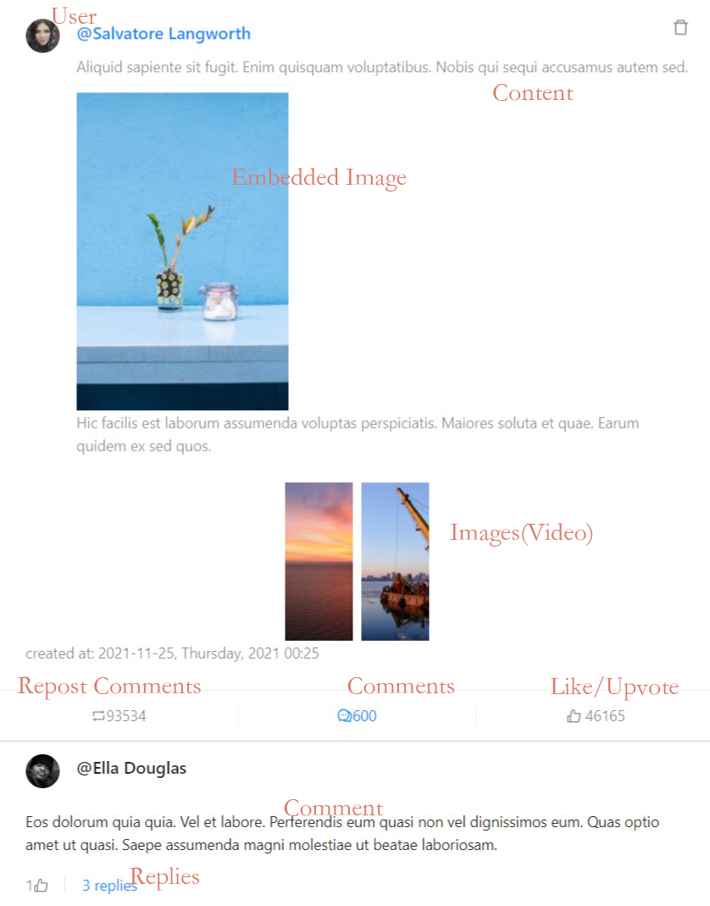

# 简介

**Social Media Archiver** 是一个 Node.js 模板，只需写少许平台相关代码，便能存档该平台的帖子(Post)。  
在它实现后，它可以归档帖子，图像和视频，以及评论和子评论。  
此外，它还有一个 UI 网页，可以从这网页上提交想要存档的帖子的 url，也可以在这网页上浏览存档的帖子。所有数据和文件都存储在本地，不涉及第三方服务器。

GitHub: [social-media-archiver](https://github.com/Combo819/social-media-archiver)  
 B 站: [social media archiver 简介](https://bilibili.com/)

## 灵感

我在使用某社交媒体时，有时我收藏了喜欢的帖子，过几天再回去看就没了。有时可能被博主自己删了，有时可能被平台删了。 我希望有个工具来备份我喜欢的帖子。 在尝试了几种方法之后，它们都不是很理想。
例如：

- archive.me：很难存档动态加载的评论，视频文件很难存档。
- 特定平台的开源爬虫：大部分是研究或业务向的，比如用来做语义分析的等等。并不是面向个人用户，没有 UI。难以配置环境。
- 截屏：难以管理。 随着时间的流逝，截图会被淹没在手机相册的众多照片里。帖子的照片也不是原图，并且无法选择文本。

最后，为了从这社交平台上备份我喜欢的帖子，我决定用 Node.js 写一个存档工具。这工具用起来很顺手，于是我把平台相关的代码剥离，并开源成一个模板。这样它就能被用于任何社交平台。

## 结构

大多数社交平台上的帖子都有类似的结构，如下图所示:

1. author（作者）
2. content （内容）
3. embed images in content （内容中的图片）
4. images or videos （图片或视频）
5. upvote （点赞）
6. comment （评论）
7. sub comment （子评论）
8. repost （转发）
9. repost comment （转发评论）

这些帖子不一定具备所有这些功能，但大多数帖子都具备其中一些功能，尤其是作者、内容和评论。
由于结构上的相似性，只需要添加平台的 API 和相应的数据转换方法，就能轻易得把帖子爬下来，这只是半天的工作。

::: tip
[head-book](https://head-book.ml) 是一个假社交媒体网站，你可以在 headbook 上看这个结构的例子。  
:::

## 运作原理

用户从网页或扩展提交一个帖子得 url。后端获取到帖子得 url 并解析出帖子 id。然后将帖子 id 传递给爬虫模块，爬虫模块获取帖子数据并从平台上下载图片和视频。  
还有一个模块负责控制请求速度，避免 429 错误。你可以在配置文件中配置请求速度。  
当用户浏览网页时，后端会从数据库中获取爬下来得数据，并将其返回给浏览器。然后网页将显示已被保存的帖子。
