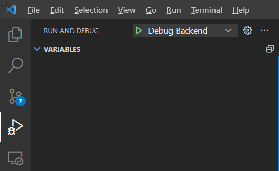

# 开始

## 背景知识

- Typescript
- Node.js

## 依赖

1. Node.js
2. npm
3. [lerna](https://lerna.js.org/#getting-started): `npm i -g lerna`

## 安装

1. 克隆仓库

```shell
git clone https://github.com/Combo819/social-media-archiver.git
```

2. 安装依赖  
对于 `npm<=6`:

```shell
cd social-media-archiver
npm ci
lerna bootstrap
```

对于 `npm>=7`:

```shell
cd social-media-archiver
npm ci --legacy-peer-deps
```

## 配置

In `packages/backend/src/Config/constants.ts`:

```typescript
const BASE_URL: string = `PLATFORM_DOMAIN`;
const Q_CONCURRENCY: number = 1; // number of concurrent API requests to the platform
const MAX_ITEM_WINDOW: number = 6; // max number of API requests to the platform in a 30s window
```

## 启动

同时启动前后端：

```shell
npm run start
```

默认情况下，前端将运行在端口`3000`上，后端将运行在端口`5000`上。  
前端的 API 调用会被自动代理到端口`5000`。  
因此，如果你正在进行前端开发，请确保后端运行在端口`5000`上。  
当你看到

```log
@social-media-archiver/backend: Development mode, Listening on port 5000
```

说明后端正在运行了。

## 调试

要调试后端，首先停止正在运行的后端，然后在 VS Code 中打开调试面板，
在下拉菜单中选择 `Debug Backend` ，然后单击`Start Debugging`按钮。



然后，你可以使用诸如断点之类的调试工具，调试消息将显示在Terminal右边的调试控制台中。

## 日志

在开发环境中，日志将显示在终端或调试控制台(对于VS Code调试模式)。还有一个日志文件在`packages/backend/log/social-media-archiver.log`    
打包后，日志文件将会在 `log/social-media-archiver.log`.
你可以使用 [pino-pretty](https://github.com/pinojs/pino-pretty) 来格式化输出的日志.

## Commit

本项目采用 `git-cz`. 当你要commit到git时， `npm run commit`， 它会自动生成一个commit信息模板.

## 技术栈
+ 前端: [React](https://reactjs.org/)
+ UI: [Ant Design](https://ant.design/)
+ 服务: [Express](https://expressjs.com/)
+ Html处理: [cheerio](https://cheerio.js.org/)
+ 控制反转: [inversify](https://inversify.io/)
+ 流量控制: [async](https://caolan.github.io/async/v3/)
+ 数据库: [rxdb](https://rxdb.info/)
+ 打包: [pkg](https://github.com/vercel/pkg)
